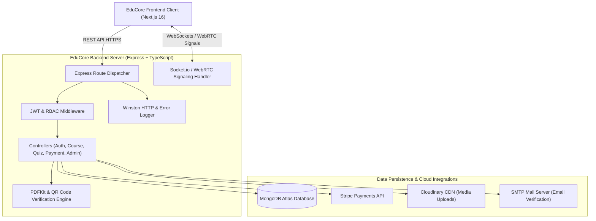

<p align="center">
  
</p>

<h1 align="center">⚡ EduCore — Backend REST API & Real-time Server</h1>

<p align="center">
  <b>Enterprise-grade, scalable backend API and real-time WebRTC signaling engine powering the EduCore SaaS Learning Management System.</b>
</p>

<p align="center">
  <a href="https://edu-core-server-ten.vercel.app"></a>
  <a href="https://edu-core-amber.vercel.app/"></a>
  
  
  
  
</p>

<p align="center">
  <a href="#-live-endpoints">Live Endpoints</a> •
  <a href="#-core-modules--architecture">Architecture</a> •
  <a href="#-api-reference">API Reference</a> •
  <a href="#-real-time-socketio--webrtc">WebRTC & Sockets</a> •
  <a href="#-database-models">Database Models</a> •
  <a href="#-local-setup--env">Local Setup</a> •
  <a href="#-license">License</a>
</p>

---

## 🌐 Live Endpoints

| Service | Protocol | Production URL | Status |
| :--- | :---: | :--- | :--- |
| **REST API Root** | HTTPS | [https://edu-core-server-ten.vercel.app/api](https://edu-core-server-ten.vercel.app/api) |  |
| **Health Check** | HTTPS | [https://edu-core-server-ten.vercel.app/health](https://edu-core-server-ten.vercel.app/health) |  |
| **Frontend Web App** | HTTPS | [https://edu-core-amber.vercel.app/](https://edu-core-amber.vercel.app/) |  |

---

## 🛠️ Core Modules & Architecture



### ⚡ Key Backend Capabilities:
1. **Role-Based Access Control (RBAC)**: Fine-grained middleware authorization for `student`, `teacher`, and `admin` roles.
2. **Stripe Payment Gateway**: Secure checkout sessions, enrollment confirmation, and instant receipt generation.
3. **Automated Assessment Engine**: Timed multi-choice quiz evaluator with score calculation and answer explanations.
4. **Assignment Grading Pipeline**: File submission handling, instructor feedback rubrics, and status tracking.
5. **Real-time WebRTC Signaling**: Peer-to-peer live streaming room signaling, stream state sync, and real-time chat via Socket.io.
6. **Dynamic Certificate Generator**: Auto-renders verifiable PDF certificates with embedded tamper-proof QR codes.
7. **Cloudinary Asset Pipeline**: Handles high-performance multi-part image, video, and PDF uploads.
8. **Serverless DNS Resiliency**: Custom IPv4 and fallback DNS resolver ensuring zero downtime on serverless edge functions.

---

## 📡 Complete REST API Reference

All protected endpoints require an `Authorization: Bearer <JWT_TOKEN>` header.

### 🔐 1. Authentication & Users (`/api/auth`, `/api/users`)
| Method | Endpoint | Access | Description |
| :---: | :--- | :---: | :--- |
| `POST` | `/api/auth/register` | Public | Register a new user (`student` or `teacher`) |
| `POST` | `/api/auth/login` | Public | Login with email & password, returns JWT token |
| `GET` | `/api/auth/me` | Authenticated | Fetch current user session & profile |
| `GET` | `/api/users` | Admin | List all registered platform users |
| `PATCH` | `/api/users/:id/role` | Admin | Update user role (`student`, `teacher`, `admin`) |

### 📚 2. Courses & Curriculum (`/api/courses`)
| Method | Endpoint | Access | Description |
| :---: | :--- | :---: | :--- |
| `GET` | `/api/courses` | Public | List and search all published courses |
| `GET` | `/api/courses/:id` | Public | Get complete course details, chapters & instructor info |
| `POST` | `/api/courses` | Teacher / Admin | Create a new course with chapters and lessons |
| `PUT` | `/api/courses/:id` | Teacher / Admin | Update course metadata, pricing or curriculum |
| `DELETE`| `/api/courses/:id` | Teacher / Admin | Delete or archive a course |

### 📝 3. Quizzes & Assessments (`/api/quizzes`)
| Method | Endpoint | Access | Description |
| :---: | :--- | :---: | :--- |
| `GET` | `/api/quizzes/:courseId` | Student / Teacher | Get all quizzes and questions for a course |
| `POST` | `/api/quizzes` | Teacher / Admin | Create a new timed quiz with MCQ questions |
| `POST` | `/api/quizzes/submit` | Student | Submit quiz answers; returns instant score & review |

### 📂 4. Assignments (`/api/assignments`)
| Method | Endpoint | Access | Description |
| :---: | :--- | :---: | :--- |
| `GET` | `/api/assignments/course/:courseId` | Enrolled | Fetch all assignments for a course |
| `POST` | `/api/assignments` | Teacher | Create a new assignment with deadline & attachments |
| `POST` | `/api/assignments/:id/submit` | Student | Submit project homework / files |
| `PUT` | `/api/assignments/:id/grade` | Teacher | Grade submission and provide feedback comments |

### 🎥 5. Live Classes (`/api/live-classes`)
| Method | Endpoint | Access | Description |
| :---: | :--- | :---: | :--- |
| `GET` | `/api/live-classes` | Authenticated | List all active & upcoming live classes |
| `POST` | `/api/live-classes` | Teacher / Admin | Schedule and start a new live class room |
| `GET` | `/api/live-classes/:id` | Authenticated | Retrieve live room details & join credentials |
| `PATCH` | `/api/live-classes/:id/end` | Teacher | End live broadcast session |

### 💳 6. Payments & Checkout (`/api/payments`)
| Method | Endpoint | Access | Description |
| :---: | :--- | :---: | :--- |
| `POST` | `/api/payments/checkout` | Student | Create Stripe Checkout Session for course purchase |
| `POST` | `/api/payments/verify` | Student | Verify payment completion and trigger enrollment |
| `GET` | `/api/payments/history` | Authenticated | Fetch purchase and invoice history |

### 📊 7. Role Dashboards (`/api/student`, `/api/teacher`, `/api/admin`, `/api/dashboard`)
| Method | Endpoint | Access | Description |
| :---: | :--- | :---: | :--- |
| `GET` | `/api/student/dashboard` | Student | Enrolled courses, completion rates, XP & streaks |
| `GET` | `/api/teacher/dashboard` | Teacher | Instructor revenue, enrolled students & analytics |
| `GET` | `/api/admin/overview` | Admin | Platform gross volume, user counts & activity logs |

---

## 🔄 Real-Time Socket.io & WebRTC Events

When running standalone, the server manages real-time WebRTC signaling and chat rooms:

```
Client (Teacher) ──[offer]──► EduCore Server ──[offer]──► Client (Student)
Client (Student) ──[answer]─► EduCore Server ──[answer]─► Client (Teacher)
Client (Peer) ───[ice-candidate]──► EduCore Server ───[ice-candidate]──► Client (Peer)
```

- **`join`** `(roomId, userId)`: Join a virtual classroom session room.
- **`signal:offer`** `(data)`: Relay WebRTC SDP offer between broadcaster and viewers.
- **`signal:answer`** `(data)`: Relay WebRTC SDP answer back to broadcaster.
- **`signal:candidate`** `(candidate)`: Exchange ICE candidates for NAT traversal.
- **`chat:message`** `(msg)`: Broadcast real-time classroom questions and chat.

---

## 🗄️ Database Models (MongoDB / Mongoose)

```
models/
├── User.ts           # Credentials, role, profile, XP, streak, badges
├── Course.ts         # Title, description, chapters, lessons, pricing, tags
├── Quiz.ts           # MCQs, time limit, passing marks, answer explanations
├── Assignment.ts     # Assignment instructions, submissions, grades, feedback
├── LiveClass.ts      # Room ID, host ID, start time, active participants
├── Order.ts          # Stripe session ID, amount, payment status, customer ID
├── Progress.ts       # Course progress percentage, completed lesson IDs
└── Category.ts       # Domain taxonomy, tags, and category hierarchy
```

---

## ⚡ Local Setup & Environment Variables

### 📋 Prerequisites
- **Node.js**: `v18.x` or higher
- **MongoDB**: MongoDB Atlas URI or local `mongodb://localhost:27017`

### 1️⃣ Installation

```bash
# Navigate to the backend directory
cd edu-core-server

# Install dependencies
npm install
```

### 2️⃣ Configure Environment Variables (`.env`)

Create a `.env` file in `edu-core-server`:

```env
PORT=5000
NODE_ENV=development

# MongoDB Connection
MONGODB_URI=mongodb+srv://<username>:<password>@cluster0.mongodb.net/edu_core

# JWT Secret
JWT_SECRET=your_jwt_super_secret_key_here

# Stripe Payments
STRIPE_SECRET_KEY=sk_test_51...

# Cloudinary (Media Uploads)
CLOUDINARY_CLOUD_NAME=your_cloud_name
CLOUDINARY_API_KEY=your_api_key
CLOUDINARY_API_SECRET=your_api_secret

# Nodemailer / SMTP (Email Verification)
SMTP_HOST=smtp.gmail.com
SMTP_PORT=587
SMTP_USER=your_email@gmail.com
SMTP_PASS=your_app_specific_password
```

### 3️⃣ Run Server

```bash
# Run in development mode with automatic reload
npm run dev

# Build TypeScript to production JavaScript
npm run build

# Start production server
npm start
```

Server will start on: **`http://localhost:5000`**

---

## 🚀 Deployment

### Deploying on Vercel
The backend is optimized for Vercel Serverless deployments with `vercel.json`:
- DNS resolution fallback ensures reliable MongoDB Atlas connections over serverless edge instances.
- Pre-configured CORS handles cross-origin requests from `https://edu-core-amber.vercel.app`.

---

## 📄 License
This project is licensed under the [MIT License](LICENSE).

---

<p align="center">
  Crafted with ⚡ for high-performance LMS infrastructure with <b>EduCore Server</b>.
</p>
